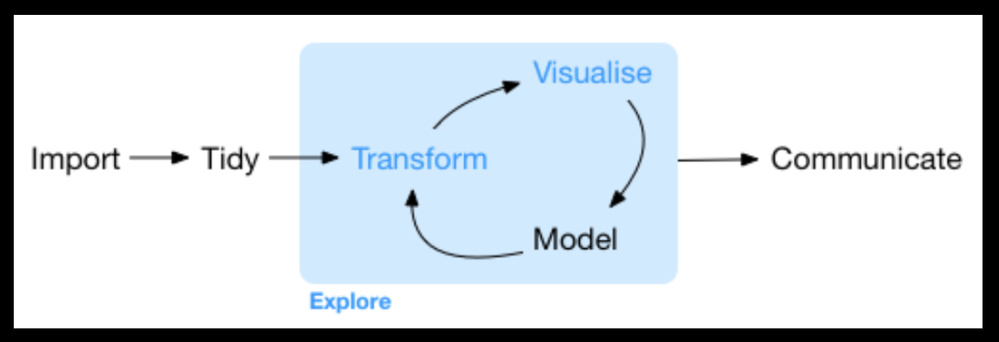

# Best Practices For Data Management

*Broman and Woo (2018)* highlight the challenges and best practices for using spreadsheets. 

The design principles that they outline are useful for your work in general and specialized statistical programs (i.e. Python, R, and many others).

+ Spreadsheets (Google Sheets, MS Excel) continue to to be a primary way for data storage, (some) analysis, and (some) visualization even for those using specialized statistical programs. 

+ Highly recommended is a workflow in which raw original data is never modified. Instead, it is imported and modified as a part of the workflow.



## Consistency and conventions

Organization is critical for reproducible research and archiving. A common scenario in your scientific practice is to have multiple time-sensitive projects occurring simultaneously, organization is critical.

Consistency is critical for: 

+ Recording categorical variables (a type of variable we will learn about in this class),

+ Use a consistent fixed code for any missing values (e.g. 'NA' or an unfilled/empty cell).

+ Use consistent variable (column) names.

+ Use a consistent data layout in multiple files (same column names). This allows data to be merged in a seamless way.

+ Use a consistent format for all dates and times (e.g. YMD, DMY).

+ Use consistent phrases in your notes. *Notes are data.* So, treating these as variables that have a binary, nominal, or ordinal value will allow you to later evaluate these quantitatively.

+ Be careful about extra spaces within cells. Again, most (all?) software will read these as character codes that must be post-processed for analysis.

+ One variable is recorded in each cell (remember, in our scheme, a comment is a variables).

+ Strive for a rectangular data layout.

+ Avoid font and cell colors as annotation.

+ Use .csv or some other file back up.

Following the approaches above will allow you to better manage your projects (including work done in this class!).

## RStudio and R
Is a developer environment for coding, data management, and version control.  

Multi-pane structure

+ Script editor  

+ Console

+ Environment and history

+ Files, plots, packages and help

### R installation

+ Open an internet browser and go to www.r-project.org.

+ Click the "download R" link in the middle of the page under "Getting Started."

+ Select a CRAN location (a mirror site) and click the corresponding link.

+ Click on the "Download R for (Mac) OS X" link at the top of the page.

+ Click on the file containing the latest version of R under "Files."

+ Save the .pkg file, double-click it to open, and follow the installation instructions.

+ Now that R is installed, you need to download and install RStudio.

### RStudio installation

+ Go to www.rstudio.com and click on the "Download RStudio" button.

+ Click on "Download RStudio Desktop."

+ Click on the version recommended for your system, or the latest Mac version, save the .dmg file on your computer, double-click it to open, and then drag and drop it to your applications folder.

### Script Editor
Allows the user to create multi-line code. It is here that you will develop your code and send it to the console. You will save your scripts as appropriately titled .r files.

To create a new R script you can either go to File -> New -> R Script, or click on the icon with the "+" sign and select "R Script", or simply press Ctrl+Shift+N. Make sure to save the script.

### Console
The console is where you can type commands and see output.

`>` is the R Prompt Symbol:
You should see the R prompt symbol in your console. If you don't see the prompt, you cannot execute code.

`+` is the R Prompt Symbol meaning you have unfinished code from the previous line. This often occurs if you have an open (unmatched) parentheses or a multiline input.  

Pressing the `ESC` will return the `>` symbol to your console.

### Files tab
The files tab shows the directory structure and allows GUI manipulation of directories.

### Plots tab
The plots tab will show all your figures and it is possible to scroll through multiple plots windows.

### Packages tab
Provides a list of installed packages and a mechanism to load new ones. Here, you can install packages here or using the command line (in the console).

```{r, eval = F}
# In the console type:
install.packages("package name in quotes")
# Example:
install.packages("dplyr")
```

For some packages you will see that "dependencies" are installed when the desired package is installed. These are the packages that the installed package needs in order to run some or all of the functions.

### Help tab

This tab will be automatically selected whenever you run help code in the Console.

### History tab
The history tab keeps a record of all previous commands. This can be useful when testing and running processes. To use archived code here, select all and click on the "To Source" icon, a window on the left will open with the list of commands. 

### Environment tab
Displays data, their classes, and dimensions in your workspace.


# Working in R

## Arithmetic operators
Symbol| Operation
------| ---------
+     | addition
-     | subtraction
*     | multiplication
/     | division
^     | exponentiation

PEMDAS applies when writing R-code
```{r, eval=FALSE}
# Arithmetic operators in action:
5 + 5 / 2
3 * 2^2
(3*2)^2 
# Arithmetic operators using objects:
z <- 5
w <- c(3,7,9,2)
s <- w[3]
z + s
```

## Arithmetic operators practice

Using what you know about parenthesis and PEMDAS, in one line of code do each of the following:  

Number | Excercise
------ | -------------------------------------------------------------------
1.     |Assign the variable `x` to be a vector containing the values 5,5,6,2  
2.     |Assign the variable `y` to be a vector containing the values 3,3,1,7
3.     |Add `x` and `y`
4.     |Substract `y` from `x` 
5.     |Assign `d` as `y` divided by `x`
3.     |Multiply `z` by `s` then add five (`z` and `s` from last practice)
4.     |Add 5 to `z` then multilply by `s`
5.     |Take `z` to the fifth power and then add 2
6.     |Divide `s` by three, then add 33, then take that sum to the 0.5 power

## Missing values (NA)

```{r, eval=FALSE}
# is.na tests for missing values
dat.1 <- c(-1,NA,1,1,-1)
dat.1 + 2
dat.1 + rep(2, length(dat.1))
```

## Dealing with missing values

+ In R, missing values are represented by "NA". 

+ Undefined values (like dividing by zero) are represented by "NaN", not a number. Often missing values are represented with numbers: -1, 99, -9999, etc. This is obviously a problem and should be avoided. You will likely need to use indexing prior using arithmetic operations to replace these values.

The "is.na" function and the "na.rm"" argument:

+ Sometimes we do not know whether there are missing values in our data. 

+ We can use the `is.na` function to test for missing values:

```{r, eval=FALSE}
# is.na tests for missing values
dat.1 <- c(-1,NA,1,1,-1)
is.na(dat.1)
which(is.na(dat.1))
```

We can use the logical `na.rm` argument to remove missing values from our data prior to executing the funciton:
```{r, eval=FALSE}
dat.1 <- c(-1,NA,1,1,-1)
mean(dat.1)
mean(dat.1, na.rm = T)
```

## Dealing with problematic values

Sometimes we code no data as -1 and that can really screw things up. R does not know that -1 means "no data". However we can replace the -1 with NA. There are many ways to do this, but here is a one way. 
```{r, eval=FALSE}
# In this example, -1 is coded as a missing data field. Think back to our logical arguments and subsetting exercises.
dat.2 <- c(2,-1,3,4,5)
dat.2 == -1
dat.2[dat.2 == -1]
dat.2[dat.2 == -1] <- NA 
```

```{r, eval=FALSE}
dat.1 <- c(2,NA,3,4,5)
# is.na tests for missing values
is.na(dat.1) 
# returns the element(s) number in the vector that is NA
which(is.na(dat.1))
```


# Data Classes in R

There are various kinds of R-objects or data structures:

1. Vectors
2. Lists
3. Matrices
4. Arrays
5. Factors
6. Data Frames

Let's first understand some of the basic datatypes on which the R-objects are built like Numeric, Integer, Character, Factor, and Logical.


## Numeric
```{r ,eval=FALSE}
num <- 1.2
print(num)
class(num)
```

## Integer
Integer: Numbers that do not contain decimal values have a data type as an integer. However, to create an integer data type, you explicitly use as.integer() and pass the variable as an argument.

```{r ,eval=FALSE}
int <- as.integer(2.2)
print(int)
class(int)
```

## Character

As the name suggests, it can be a letter or a combination of letters enclosed by quotes is considered as a character data type by R.

```{r ,eval=FALSE}
char <- "datacamp"
print(char)
class(char)
char <- "12345"
class(char)
```

## Logical
Logical: A variable that can have a value of True and False like a boolean is called a logical variable.

```{r ,eval=FALSE}
log_true <- TRUE
print(log_true)
class(log_true)
log_false <- FALSE
class(log_false)
```

## Factor

Factor: They are a data type that is used to refer to a qualitative relationship like colors, good & bad, course or movie ratings, etc. They are useful in statistical modeling.

```{r ,eval=FALSE}
fac <- factor(c("good", "bad", "ugly","good", "bad", "ugly"))
print(fac)
class(fac)
levels(fac)
nlevels(fac)
class(levels(fac))
```

## List
Unlike vectors, a list can contain elements of various data types and is often known as an ordered collection of values. It can contain vectors, functions, matrices, and even another list inside it (nested-list).

```{r, eval=FALSE}
lis1 <- seq(1,5)     # Integer Vector
lis2 <- factor(1:5)  # Factor Vector
lis3 <- letters[1:5] 
combined_list <- list(lis1, lis2, lis3)

combined_list[[1]]
combined_list[[2]]
combined_list[[3]]
combined_list[[3]][5]

flat_list <- unlist(combined_list)
class(flat_list)
```

## Vectors
Vectors are an object which is used to store multiple information or values of the same data type. A vector can not have a combination of both integer and character. For example, if you want to store 100 students' total marks, instead of creating 100 different variables for each student, you would create a vector of length 100, which will store all the student marks in it.

```{r ,eval=FALSE}
marks <- c(88,65,90,40,65)
marks[4]
marks[1]
marks[6]
```

### Slicing vectors
```{r ,eval=FALSE}
marks[seq(1,4)]
marks[c(1,2,4)]
```

```{r ,eval=FALSE}
char_vector <- c("a", "b", "c")
class(char_vector)
length(char_vector)
char_vector[1:3]
char_vector[-3]
char_num_vec <- c(1,2, "a")
```
```{r ,eval=FALSE}
char_vector <- c("a", "b", "c")
class(char_vector)
length(char_vector)
char_vector[1:3]
char_vector[-3]
```

```{r ,eval=FALSE}
vec <- seq(1,1024)
vec <- c(1:1024)
```
## Matrix

Similar to a vector, a matrix is used to store information about the same data type. However, unlike vectors, matrices are capable of holding two-dimensional information inside it.

```{r ,eval=FALSE}
M <- matrix(vector, 
            nrow=r, 
            ncol=c, 
            byrow=FALSE, 
            dimnames=list(char_vector_rownames, char_vector_colnames))

# byrow=TRUE signifies that the matrix should be filled by rows. 
# byrow=FALSE indicates that the matrix should be filled by columns (the default).
```


```{r ,eval=FALSE}
M <- matrix(seq(1,6), 
            nrow = 2, ncol = 3, byrow = TRUE)

M <- matrix(seq(1,6), 
            nrow = 2, ncol = 3, byrow = F)
```

## DataFrame

Unlike a matrix, Data frames are a more generalized form of a matrix. It contains data in a tabular fashion. The data in the data frame can be spread across various columns, having different data types. 


```{r ,eval=FALSE}
dataset <- data.frame(
   Person = c("Aditya", "Ayush","Akshay"),
   Age = c(26, 26, 27),
   Weight = c(81,85, 90),
   Height = c(6,5.8,6.2),
   Salary = c(50000, 80000, 100000))

class(dataset)
nrow(dataset) 
ncol(dataset) 
df1 <- rbind(dataset, dataset) 
df2 <- cbind(dataset, dataset)
head(df1,3) 
str(dataset) 
summary(dataset)


```


# Data input and output (IO)

## Some considerations: 

1.  Keep the names of local files downloaded from the internet or copied onto your computer unchanged. This will help you trace the provenance of the data in the future.

2. R's native file format `.RData` can be accessed using `load` and `save.`

## Reading and Writing Files

There are many methods to read and write files in R programming. Your command of these is critical because all scientific work begins with data, and most data is found inside files and databases.

Dealing with input is probably the first step of implementing any significant project.

## Small data

+ For very small datasets, is may be preferred to enter the data by hand.

`c` is a common function used for combine: 
```{r, eval = FALSE}
x <- c(3,7,11,19)
y <- c(1,1,1,1)
c(x,y)
y <- c(x,y,5)
```

There are a suite of functions to enter data in the console. The sequence function `seq`:
```{r, eval=FALSE}
y <- seq(from = 1, to = 10)
y <- seq(from = 1, to = 10, by = 2.5)
y <- seq(from = 1, to = 10, length.out = 22)
```

Use the function `rep` (repeat):
```{r, eval=FALSE}
y <- rep(x = 5, times = 4)
x.value <- c(2,3)
rep(x.value, times = 3)
```


## Practice 

Number| Excercise
------| -------------------------------------------------------------------
1.    |How many different ways can you create a vector labled `q` containing two 3's and four 5's? Try some!
2.    |Assign a vector of four elements: 3,7,9 and 2 to `w`.
3.    |Assign the third element of `w` to `s`, where `s` is equal to 6. 
4.    |What is the length of a sequence that starts at 1.1, ends at 9.2, and has increments of 0.894?
5.    |What is the 3rd value of the sequence you created?

```{r ,eval=FALSE}
# Create a data frame using the "data.frame" function
site.name <- c(rep("Site.01",3),rep("Site.02",3))
density <- rep(x = 2.3, times = length(site.name))
abundance <- seq(from = 14.5, to = 19.8, length.out = length(site.name))
sampled. <- c(F, T, F, F, T, F)
y.data.frame <- data.frame(site.name, density, abundance, sampled.)
y.data.frame
class(y.data.frame)
```

## Large(r) data

### Read csv

+ Most scientific work will involve data larger than can be entered by hand.

+ In this case we will use a suite of commands and different packages to get the data into our environment.

```{r, eval = F, echo = T}
read.csv("./Data/co2.csv")
```

### Read xlsx

+ MS Excel files are widely used

```{r, eval = F, echo = T}
install.packages('readxl')
require('readxl')

read_xlsx("./Data/Codes.xlsx", sheet = 1)
```


### Download data from public repository
```{r, eval=FALSE}

Website can be found here: "https://www.stats.govt.nz/large-datasets/csv-files-for-download/"

The data are accessed by this URL:
url <- "https://www.stats.govt.nz/assets/Uploads/Annual-enterprise-survey/Annual-enterprise-survey-2020-financial-year-provisional/Download-data/annual-enterprise-survey-2020-financial-year-provisional-csv.csv"

You can see that the url links to a .csv file. This is a file in an online directory. Access the directory in a web browser: https://www.stats.govt.nz/
  
destfile <- "./Data/output.csv"

download.file(url, destfile)

```
