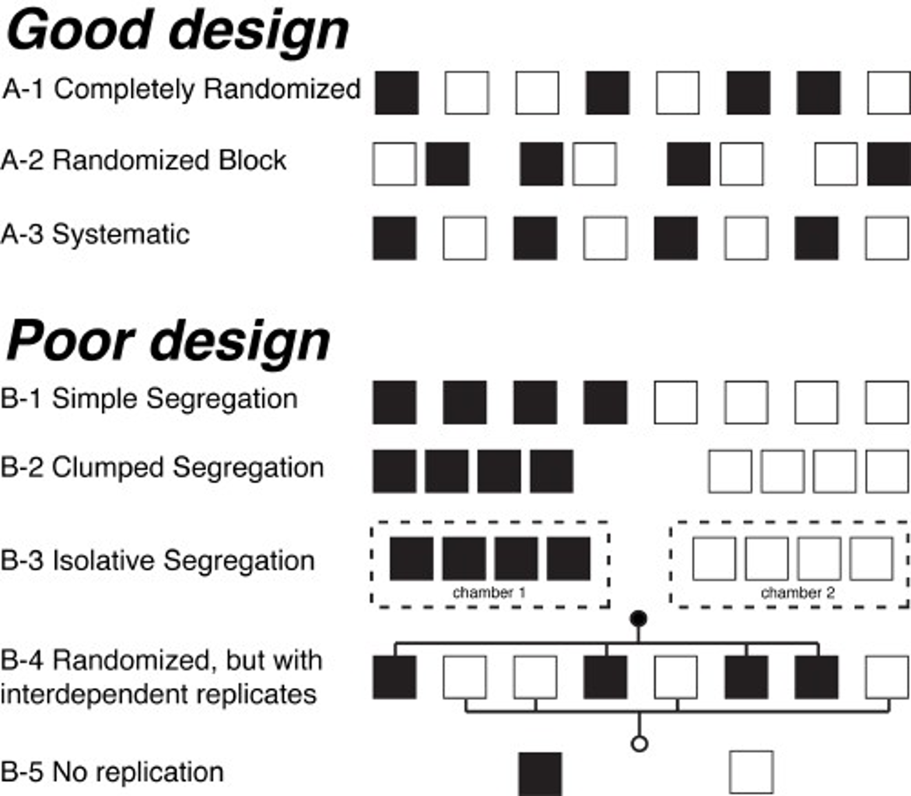
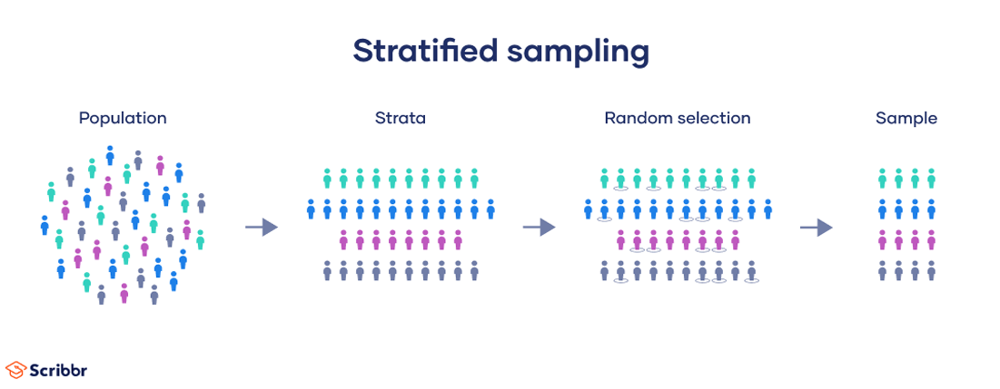

site: "bookdown::bookdown_site"
output:
  bookdown::gitbook:
    lib_dir: "book_assets"
  bookdown::pdf_book:
    keep_tex: yes


# Sampling

Statistical analyses are performed on samples that are taken from large populations (we consider most populations to be infinitely large and thus sampling is necessary). The goal is to sample some elements in a population that are representative of the whole population. 

This saves resources because it is not desirable or feasible to sample every element in a population. 

Sampling every element in a population is called a *census*.

The most challenging aspect of a sampling program is to ensure that the sample taken from the population is a random one.

## Replication

Replication means having replicate observations at a spatial and temporal scale that matches the application of the experimental treatments. 

Replicates are essential because biological systems are inherently variable and this is particularly so for ecological systems. 

## Simple Random Sampling

To accomplish this, the most robust approach is to use simple random sample (termed *SRS*). 

From QK "You can’t really go wrong with simple random sampling." But...

"The downside of simple random sampling is that it may be less efficient than other sampling designs, especially when there is identified heterogeneity in the population or we wish to estimate parameters at a range of spatial or temporal scales."

In SRS, each unit in the population is identified, and each unit has an equal chance of being in the sample. This is the only way to obtain a *statistically valid* and *representative* sample.

+ Ensuring that data are collected in a random fashion allows statistics to be calculated. Non-random data collection disallows this. Only statistically valid observations can be used for analysis.

+ Consider Exit polling vs. Twitter polls to estimate proportion voting for a candidate. Why does one provide a better estimate than another?

+ BTW, this is the primary issue with current political polling - the quest to get a representative sample (https://fivethirtyeight.com/features/is-the-polling-industry-in-stasis-or-in-crisis/)

## Some Terminology of Sampling

* a *population* is the entire collection of people or things you are interested in (all cannot be measured, or even should be);
* a *sample* is a subset of some of the units in the population;
* a *statistic* or *summary statistic* is a value that results from measuring all the units in the sample (e.g. mean, mode, range);

For example, to find out the average age of all motor vehicles in the state in 2022:

* *Population* = all motor vehicles in the state in 2022
* *Sample* = 300 randomly selected motor vehicles
* *Statistic* = the average age of the 300 motor vehicles in the sample

Statistics derived from samples are used to estimate population parameters.

In the above example, we would say that the sample statistic (sample mean) is our best estimate of the population mean. We did not perform a census, so we don't know what the mean of the population is, but instead use our sample statistic.

Another example, how to select a sample of 25 people who live in your college dorm, and ensure a random sample you might:

* Make a list of all the 250 people who live in the dorm. 

* Assign each person a unique number, between 1 and 250. 

* Then refer to a table of random numbers. 

* Starting at any point in the table, read across or down and note every number that falls between 1 and 250. 

* Use the numbers you have found to pull the names from the list that correspond to the 25 numbers you found. 

* These 25 people are your sample. This is called the table of random numbers method.

## Independence of samples 
*Independence* is also a critical aspect of sampling. Independence implies that sampling (measuring) of one element in the population will not impact or predict the value of another element.

## Why do we want to collect representative samples?
We use statistical analysis to describe (calculate) the values of sample statistics among or between populations. For example, is the mean value different between two populations or to test whether a statistic (like the mean) is different from some hypothesized value.

### R Code
```{r,message=FALSE, echo=FALSE, warning=FALSE}
gsub('(.{1,90})(\\s|$)', '\\1\n', paste(prefix., input.content[5])) %>% cat()
```

```{r,message=FALSE, echo=FALSE, warning=FALSE}
responses.gpt[5] %>% cat()
```

## Sampling Design Considerations

Hurlburt (1984)

Now that we know what constitutes a valid sample, lets look at some ways (and some ways not) to collect (and analyze) samples.

Hurlburt's paper has been instrumental in promoting an understanding of *pseudoreplication* and the term has become widely used. Scientists have become more aware of the need for close concordance of design, analysis, and interpretation of experiments. 

*“No one would now dream of testing the response to a treatment by comparing two plots, one treated and the other control.” Fisher and Wishart (1930).*

Hurlburt evaluated the frequency of *pseudoreplication* as a fatal flaw of experiments (Hurlbert, 1984. Ecological Monographs 54:187‐211). The 'fatal flaw' implies that the conclusions of the work are not supported because the sampling was done improperly.

In the paper, Hurlburt

* Evaluated 176 studies from 1960 to 1984.

* He found that 27% overall or 48% of those making statistical inferences used “pseudoreplicated” approaches.

* The term pseudoreplication refers to "the use of inferential statistics to test for treatment effects with data from experiments where either treatments are not replicated (though samples may be) or replicates are not statistically independent.“

* The context of his paper was ecological field experiments, but pseudoreplication can occur in other contexts as well.

## What is Pseudoreplication?

* Replication refers to having more than one experimental (or observational) unit with the same treatment.

* Each unit with the same treatment is called a replicate.

* Most models for statistical inference require true replication.

* True replicates are often confused with repeated measures or with pseudoreplicates.

## Examples of Pseudoreplication

1. Suppose a blood-pressure lowering drug is administered to a patient, then the patient's blood pressure is measured twice. This is a repeated measure, not a replication. It can give information about the uncertainty in the measurement process, but not about the variability in the effect of the drug. On the other hand, if the drug were administered to two patients, and each patient's blood pressure was measured once, we can say the treatment has been replicated, and the replication may give some information about the variability in the effect of the drug.

2. A researcher is studying the effect on plant growth of different concentrations of CO2 in the air.  He needs to grow the plants in a growth chamber so that the  CO2 concentration can be controlled. He has access to only two growth chambers, but each one will hold five plants.  However, since the five plants in each chamber share whatever conditions are in that chamber besides the CO2 concentration, and in fact may also influence each other, they are not independent replicates but are pseudoreplicates. The growth chambers are the experimental units; the treatments are applied to the growth chambers, not to the plant independently.

3. Two fifth-grade math curricula are being studied. Two schools have agreed to participate in the study. One is randomly chosen to use curriculum A, the other to use curriculum B. At the end of the school year, the fifth-grade students in each school are tested and the results are used to do a statistical analysis comparing the two curricula. There is no true replication in this study; the students are pseudo-replicates. The schools are the experimental units; they, not the students, are randomly assigned to treatment. Within each school, the test results (and the learning) of the students in the experiment are not independent; they are influenced by the teacher and other school-specific factors (e.g., previous teachers and learning, socioeconomic background of the school, etc.).

## Sample allocation

Hurlbert’s other primary concern with proper experimental design is to ensure independence. 

He shows that with randomization methods do not always giving good interspersion of treatments (spatial and temporal).

Hence his focus on random interspersion of samples from a population.



## Systematic Sampling

SS is a probability sampling method where members of population selected at regular interval (*k*).

The benefits of SS are that is imitates the randomization benefits of simple random sampling but can be easier to conduct.

To employ this we will take a full list of the population and sample every $k^{th}$ object.

To determine *k* divide estimated population size by sample size.

### Stratified Random Sampling 

The way in which was have selected sample units thus far has required us to know little about the population of interest in advance of selecting the sample. 

This approach is ideal only if the characteristic of interest is distributed homogeneously across the population. 

In a *stratified sample*, researchers divide a population into subpopulations called strata (the plural of stratum) based on specific characteristics (e.g., habitat, niche, taxanomic status, location, etc.). Every member of the population studied should be in exactly one stratum.

For example, if we have information that we know to be associated with the heterogeneity in the population, we can use that ancillary information to guide alternative strategies for selecting samples that will yield estimates with higher precision that a simple random sample for the same amount of effort. The first of these designs is stratified random sampling. 

A stratified random sample is one obtained by dividing the population elements into mutually exclusive, non-overlapping groups of sample units called strata, then selecting a simple random sample from within each stratum (stratum is singular for strata). 

Stratifying involves classifying sampling units of the population into relatively homogeneous groups before (usually) selecting sample units. Strata are based on information other than the characteristic being measured that is known to or thought to vary with the characteristic of interest.



Because virtually all ecological systems are heterogeneous, stratifying is used commonly as a way to increase precision in ecological studies. Common strata in ecological studies include elevation, aspect, or other geographic features for studying plant communities and vegetation communities or soils for studying some animal communities. When choosing among several potential strata, seek strata that best minimize variation in the characteristic of interest within strata and that maximize variation among strata. 

How it is implemented:
*  Divide the entire population into non-overlapping strata
*  Select a simple random sample from within each strata 

*L* = number of strata
$n_i$ = number of sample units within stratum *i*
*n* = number of sample units in the population 

Estimates from stratified random samples are simply the weighted average or the sum of estimates from a series of simple random samples, each generated within a unique stratum. 

$\bar{y} = \sum_{h=1}^{L}W_{h}\bar{y}_h$, 

where there are h = 1 to L strata, $W_h$ is the proportion of total units in stratum *h* (often estimated from the proportion of total area in stratum *h*) and $\bar{y}_h$ is the sample mean for stratum *h*.

### Allocating Sampling Effort among Strata 

Using stratified random sampling requires that we decide how to divide a fixed amount of sampling effort among the different strata; that process is called allocation. When deciding where to allocate sampling effort, the question becomes how best to allocate effort among strata so that the sampling process will provide the most efficient balance of effort, cost, and estimate precision.

* Uniform Allocation (equal number for all strata)

* Allocation Proportional to Size

* Allocation Proportional to Variation (developed from pilot study)

# Central Limit Theorem

The central limit theorem (CLT) states that the distribution of sample means approximates a normal distribution as the sample size becomes larger regardless of the population distribution shape.

The sample theory is the study of relationships existing between a population and samples drawn from population.

Consider all possible samples of size *n* that can be drawn from the population. For each sample, we can compute statistic like mean or a standard deviation, etc that will vary from sample to sample. This way we obtain a distribution called as the sampling distribution of a statistic. If the statistic is sample mean , then the distribution is called the sampling distribution of mean.

If we take many sets of samples from a population, and calculated the mean of these, we could plot the frequency distribution of the sample means.

This distribution is the 'sampling distribution'  It: 

1.) The sampling distribution from a normal distribution is normally-distributed.

2.) As sample size increases (to infinity), the sampling distribution, from any distribution, will approach a normal distribution.

3.) The expected value (the mean) of the sample distribution will be the mean of the population distribution.

### Example of the CLT (Die Rolling)

A fair die can be modeled with a discrete random variable with outcome 1 through 6, each with the equal probability of 1/6.

```{r}
DieOutcome <- sample(1:6,10000, replace= TRUE)
hist(DieOutcome, col ="light blue")
abline(v=3.5, col = "red",lty=1)

```

We will take samples of size 10 , from the above 10000 observation of outcome of die roll, take the arithmetic mean and try to plot the mean of sample. we will do this procedure k times (in this case k= 10000 )

```{r}
x10 <- c()
k =10000
for ( i in 1:k) {
  x10[i] = mean(sample(1:6,10, replace = TRUE))}
hist(x10, col ="pink", main="Sample size =10",xlab ="Outcome of die roll")
abline(v = mean(x10), col = "Red")
abline(v = 3.5, col = "blue")

```


By theory , we know as the sample increases, we get better bell shaped curve. As the n apporaches infinity , we get a normal distribution. Lets do this by increasing the sample size to 30, 100 and 1000.

```{r}
x30 <- c()
x100 <- c()
x1000 <- c()
k =10000
for ( i in 1:k){
  x30[i] = mean(sample(1:6,30, replace = TRUE))
  x100[i] = mean(sample(1:6,100, replace = TRUE))
  x1000[i] = mean(sample(1:6,1000, replace = TRUE))
}
par(mfrow=c(1,3))
hist(x30, col ="green",main="n=30",xlab ="die roll")
abline(v = mean(x30), col = "blue")

hist(x100, col ="light blue", main="n=100",xlab ="die roll")
abline(v = mean(x100), col = "red")

hist(x1000, col ="orange",main="n=1000",xlab ="die roll")
abline(v = mean(x1000), col = "red")

```

### Example of the CLT (Coin Flipping)

Flipping a fair coin many times the probability of getting a given number of heads in a series of flips should follow a normal curve, with mean equal to half the total number of flips in each series. Here 1 represent heads and 0 tails.

```{r}
x <- c()
k =10000  
for ( i in 1:k) {  
  x[i] = mean(sample(0:1,100, replace = TRUE))}  
hist(x, col ="light green", main="Sample size = 100",xlab ="flipping coin ")  
abline(v = mean(x), col = "red")
```
